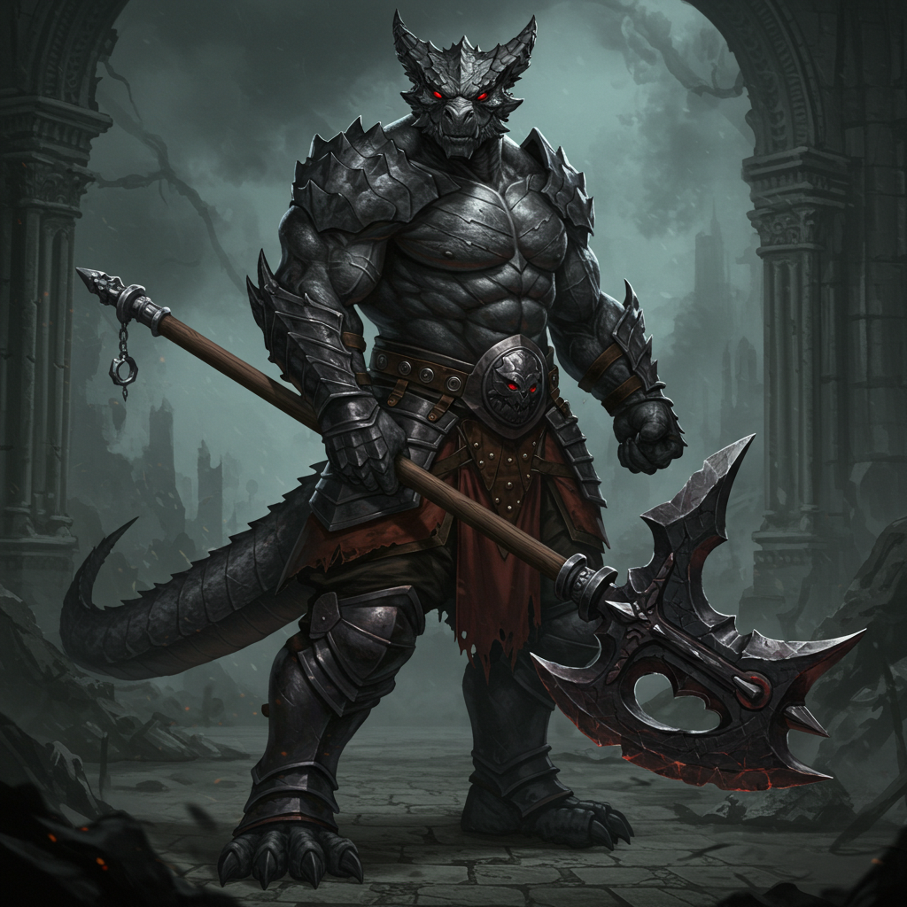
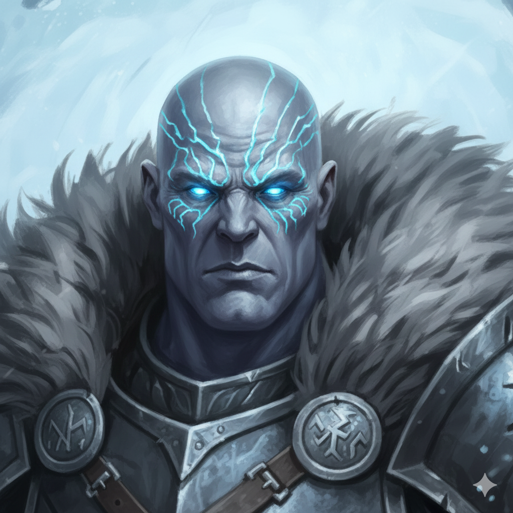
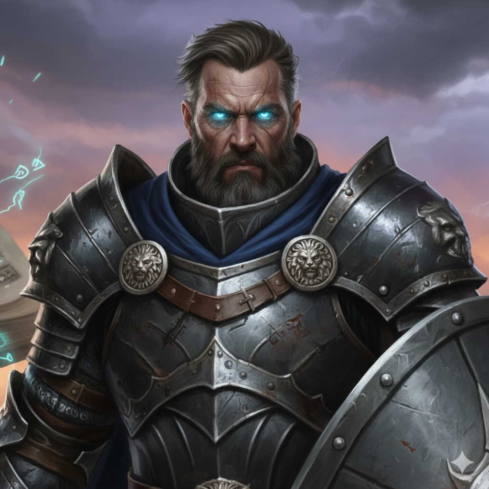
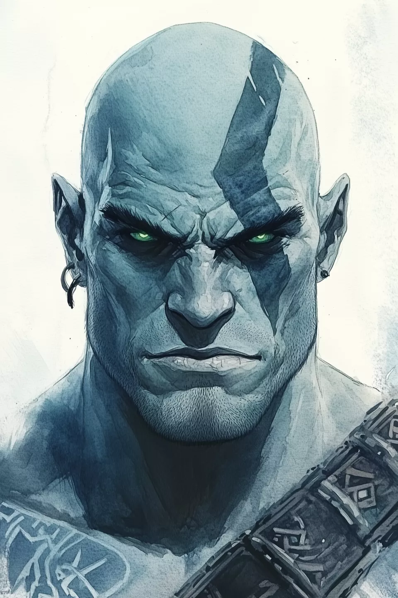
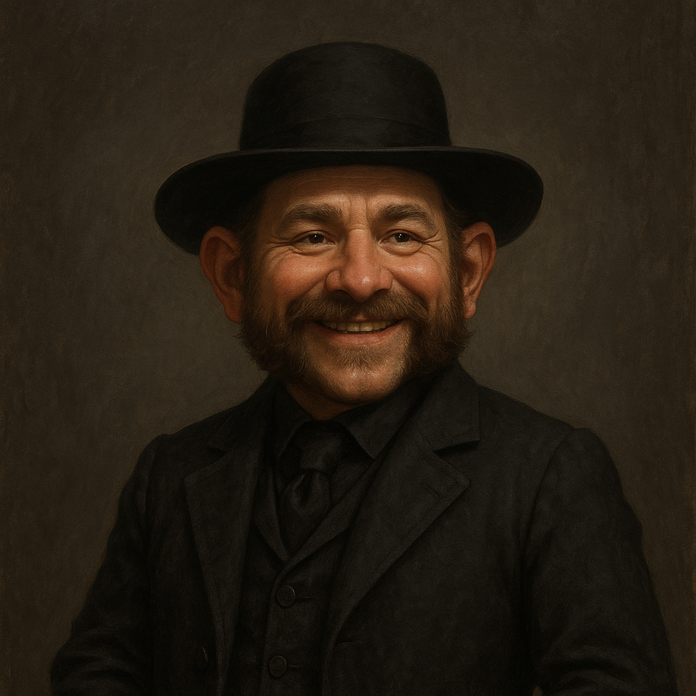

# 🐉 D&D Character Repository

A centralized portfolio of Dungeons & Dragons 5th Edition characters, tracking their stats, build plans, and campaign journals.

| Portrait | Character Profile |
| :---: | :--- |
|  | **[Bwayne](bwaynebruce/)** _Paladin (Oath of Vengeance) 9_ A former mob enforcer turned divine executioner. Bwayne serves Hoar, the Doombringer, delivering poetic justice with a halberd and a grim silence. |
|  | **[Hrimgar Frostborn](hrimgarfrostborn/)** _Ranger 2 / Druid (Circle of the Sea) 7_ A Goliath of Frost Giant ancestry. Hrimgar embodies the wrath of the winter storm, transforming into a massive elemental force of ice and water on the battlefield. |
|  | **[Klaus von Stauffer](klausvonstauffer/)** _Fighter 2 / Wizard (Order of Scribes) 7_ The "Iron Quill." A heavily armored tactical wizard who treats magic like military artillery. Guided by a sentient, demanding spellbook known as "The Codex." |
|  | **[Kram Gor](kramgor/)** _Paladin (Oath of Conquest) 6_ A Goliath resurrected by Auril, the Frostmaiden. Once a warm-hearted barbarian, he is now a silent conqueror wielding fear and cold as his weapons in the frozen north. |
|  | **[Silas Graves](silasgraves/)** _Wizard (Necromancer) 7_ A benevolent Rock Gnome Necromancer. Silas views his undead companions not as tools, but as souls given a second chance to fulfill a purpose. Currently traversing the mists of Barovia. |
|  | **[Vesper](vesper/)** _Druid (Circle of Stars) 9_ A small Scourge Aasimar channeling the terrifying, burning power of the cosmos. Vesper is a vessel for star-stuff, balancing fragile mortality with infinite power. |

---

## 📚 Repository Guidelines

*   **System:** D&D 5e (2024 Revision).
*   **Updates:** Each character folder contains their specific `character-sheet.md` which serves as the source of truth for stats and items.
*   **Sync:** All changes are automatically synced to the remote repository.
