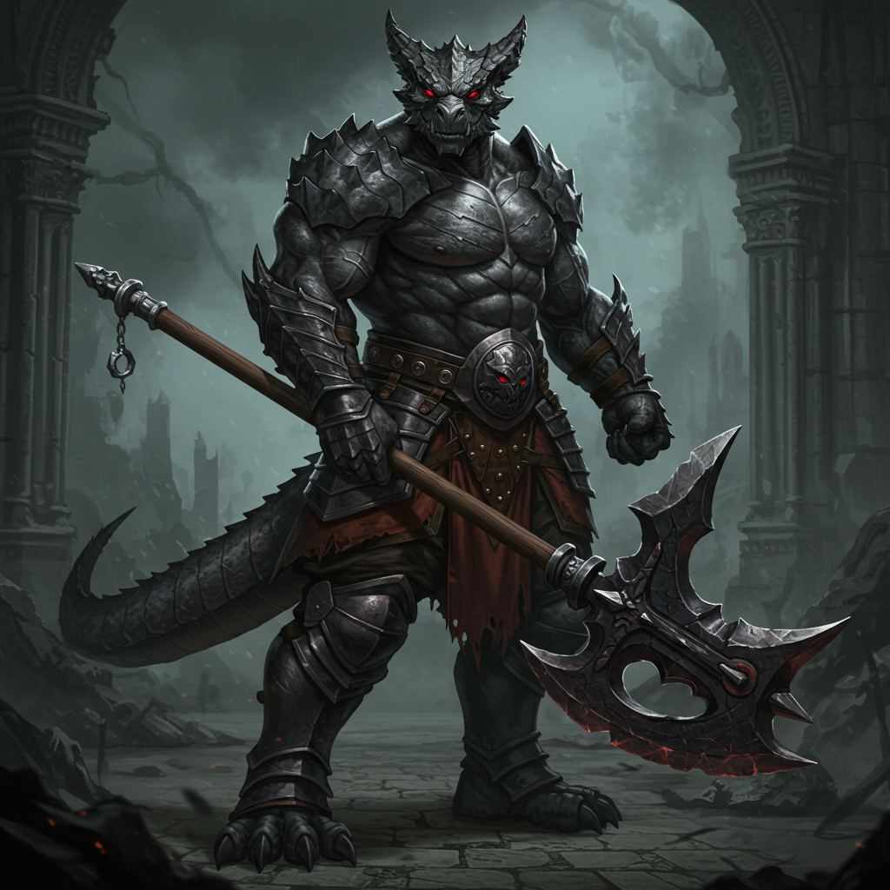
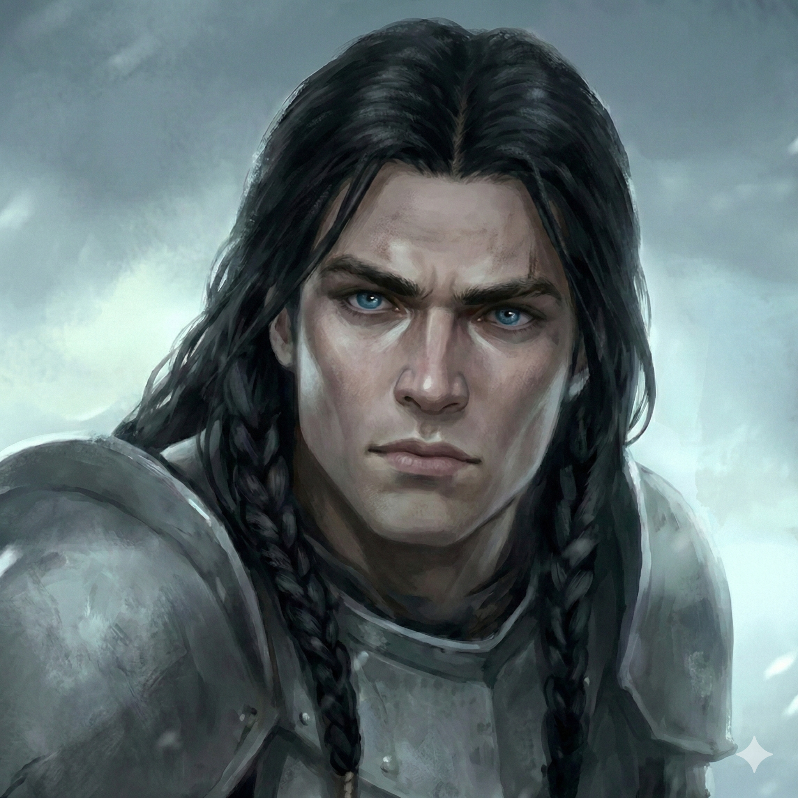
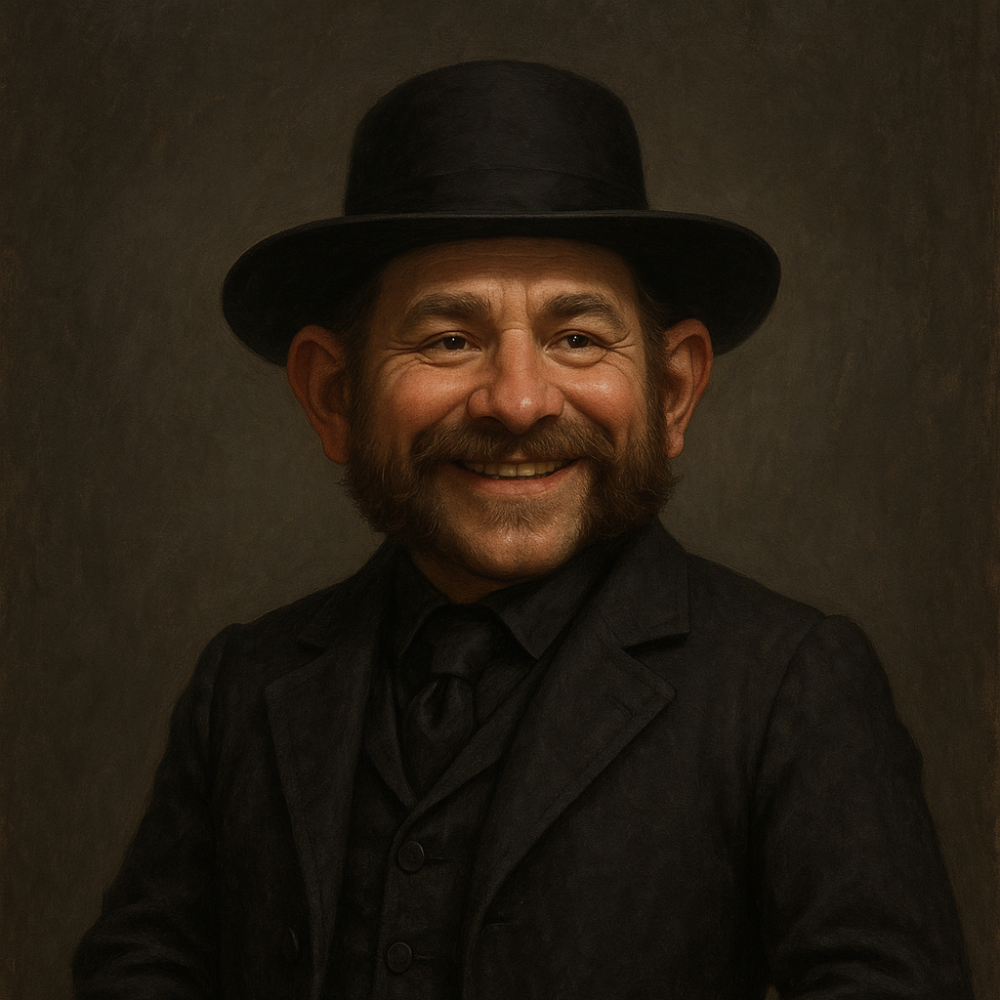
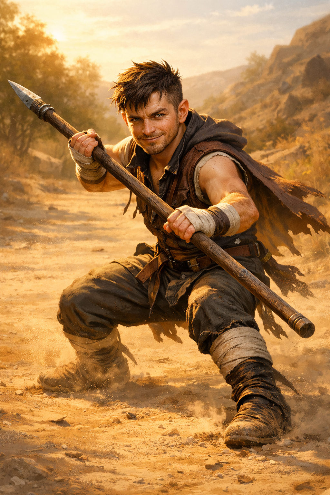

# 🐉 D&D Character Repository

A centralized portfolio of Dungeons & Dragons 5th Edition characters, tracking their stats, build plans, and campaign journals.

| Portrait | Character Profile |
| :---: | :--- |
|  | **[Bwayne](bwaynebruce/)** _Paladin (Oath of Vengeance) 9_ A former mob enforcer turned divine executioner. Bwayne serves Hoar, the Doombringer, delivering poetic justice with a halberd and a grim silence. |
|  | **[Hrimgar Frostborn](hrimgarfrostborn/)** _Ranger 2 / Druid (Circle of the Sea) 7_ A Goliath of Frost Giant ancestry. Hrimgar embodies the wrath of the winter storm, transforming into a massive elemental force of ice and water on the battlefield. |
|  | **[Andrick Coldmark](andrickcoldmark/)** _Fighter (Battle Master) 6_ The "Black Knight of the Dale." A faceless wall of matte-gray steel who controls the battlefield with tactical precision and silent, unyielding presence. |
|  | **~~[Kram Gor](kramgor/)~~** (DECEASED) _Paladin (Oath of Conquest) 6_ The "Silent Winter." Fallen in battle against a Lich in Icewind Dale. His silence is now absolute. |
|  | **~~[Silas Graves](silasgraves/)~~** (DECEASED) _Wizard (Necromancer) 9_ A benevolent Rock Gnome Necromancer. Silas viewed his undead companions not as tools, but as souls given a second chance to fulfill a purpose. Lost to the mists of Barovia. |
|  | **[Vesper](vesper/)** _Druid (Circle of Stars) 9_ A small Scourge Aasimar channeling the terrifying, burning power of the cosmos. Vesper is a vessel for star-stuff, balancing fragile mortality with infinite power. |
|  | **[Gaar the Great](gaarthegreat/)** _Wizard (School of Evocation) 10_ A 7'8" Goliath with hippie energy and an obsession with the "wizard aesthetic." Gaar runs a one-man traveling magic show and brings the good vibes — and the occasional Fireball — to the mists of Barovia. |
|  | **[Chance McGinty](chancemcginty/)** _Monk (Warrior of the Open Hand) 3_ A jovial Halfling traveler who sits by the road with a sign that says "Test Your Luck." He fights for the joy of the sport and the thrill of the gamble. |

---

## 📚 Repository Guidelines

*   **System:** D&D 5e (2024 Revision).
*   **Updates:** Each character folder contains their specific `character-sheet.md` which serves as the source of truth for stats and items.
*   **Sync:** All changes are automatically synced to the remote repository.
