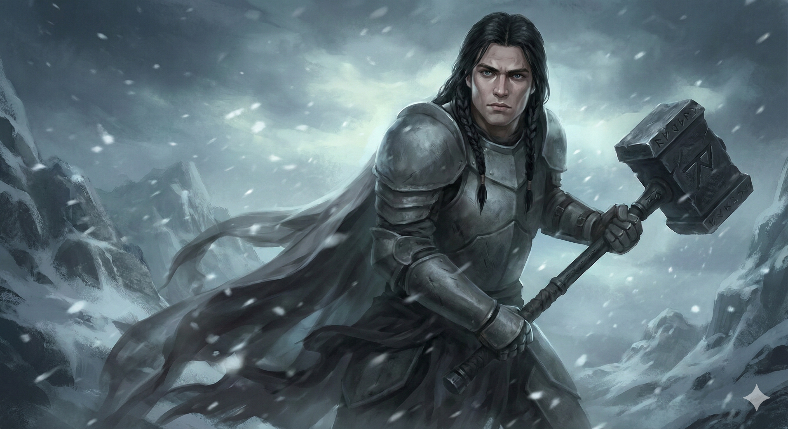

# Andrick Coldmark
### Fighter (Battle Master) 6 | Icewind Dale

> *"..." (Andrick simply points his maul at the enemy, then at the ground.)*

## Character Overview
Andrick Coldmark, known as the "Black Knight of the Dale," is a silent tactical genius from the Tribe of the Elk. A stark contrast against the blinding white of Icewind Dale, he is a faceless wall of matte-gray steel. His entire world revolves around the protection of his sister, Anika; he is her silent sentinel, the iron wall that stands between her and anything that would do her harm.

*   **Class:** Fighter (Battle Master)
*   **Race:** Human (2024 Rules)
*   **Background:** Farmer (Tribe of the Elk)
*   **Alignment:** Lawful Neutral
*   **Current HP:** 76
*   **Maneuver Save DC:** 16

## The Iron Wall
Andrick specializes in total battlefield control and defense:

*   **Anika's Shadow:** Using the *Sentinel* feat and *Bait and Switch* maneuver to rescue allies and lock down threats.
*   **The Lockdown:** Combining the *Topple* weapon mastery with *Sentinel* to leave enemies prone and immobilized.
*   **Cloak of Displacement:** A shifting shadow that makes him nearly impossible to hit in his heavy plate armor.

## Project Files Structure

Documentation for Andrick's combat role and progression.

*   **`andrick_coldmark.md`** - The primary character sheet and backstory.
*   **`andrick_combat_cheatsheet.md`** - Quick-reference guide for maneuvers and reactions.
*   **`build_plan.md`** - The leveling roadmap (Levels 7-12) focusing on "The Iron Wall."
*   **`portrait_prompt.md`** - Detailed prompts for Andrick's visual representation.

## Technical Details
*   **Ruleset:** D&D 5th Edition (2024 Revision).
*   **Key Items:** +1 Maul (Topple), Cloak of Displacement, Dread Helm.
*   **Key Features:** Action Surge, Tactical Mind, Combat Superiority (d8s).

---
*Created and managed with the assistance of the Gemini CLI Agent.*
