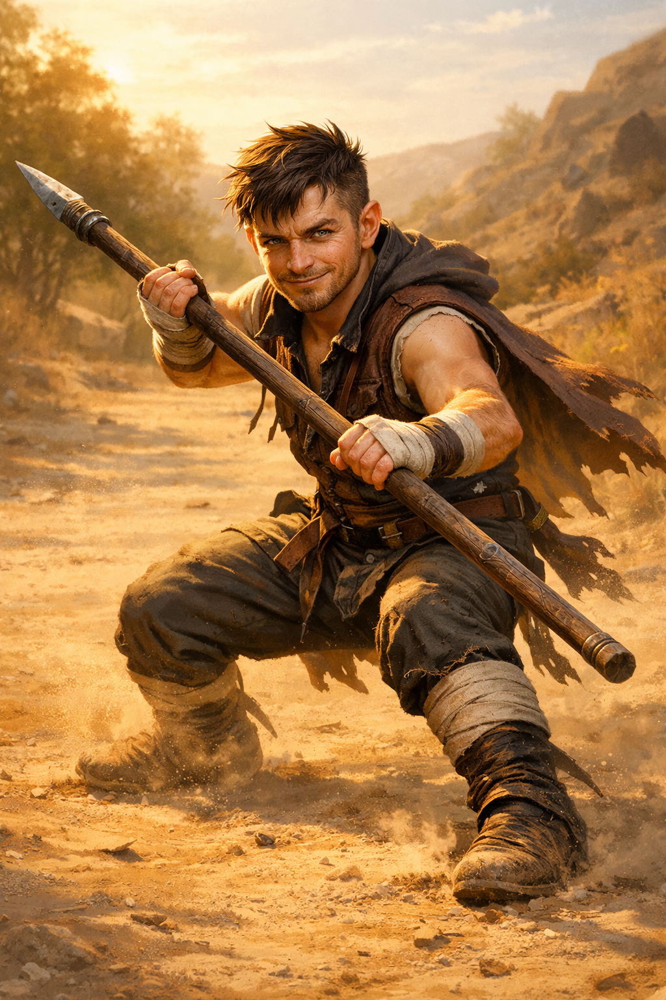

# Chance McGinty

**Race:** Lightfoot Halfling
**Class:** Monk (Warrior of the Open Hand)
**Level:** 3
**Background:** Wayfarer
**Alignment:** Neutral Good
**Proficiency Bonus:** +2

---

## Ability Scores

| Ability | Score | Modifier | Notes |
| :--- | :--- | :--- | :--- |
| **STR** | 8 | -1 | |
| **DEX** | 17 | +3 | Primary Attack/Defense |
| **CON** | 14 | +2 | |
| **INT** | 8 | -1 | |
| **WIS** | 16 | +3 | Save DC/Defense |
| **CHA** | 10 | +0 | Roadside Charm |

---

## Combat & Core Stats

*   **Hit Points:** 24 (8 + 5 + 5 + 6 CON)
*   **Armor Class:** 16 (Unarmored Defense: 10 + 3 DEX + 3 WIS)
*   **Initiative:** +3
*   **Speed:** 40 ft. (30 base + 10 Unarmored Movement)
*   **Senses:** Passive Perception 15 (Proficiency missing but Wisdom is high - adjust if Perception skill added later)
*   **Languages:** Common, Halfling

### Attacks
*   **Spear (Two-Handed):** +5 to hit, 1d8+3 piercing. **Mastery: Sap** (Target has Disadvantage on next attack).
*   **Unarmed Strike:** +5 to hit, 1d6+3 bludgeoning.
*   **Dagger (Thrown):** +5 to hit, 1d4+3 piercing. Range 20/60.

---

## Features & Traits

### Halfling Traits (2024)
*   **Halfling Luck:** Reroll natural 1s on d20 rolls.
*   **Brave:** Advantage on saves vs. Frightened.
*   **Halfling Nimbleness:** Move through spaces of creatures larger than you.
*   **Naturally Stealthy:** Hide behind creatures at least one size larger.

### Monk Class Features (2024)
*   **Martial Arts:** Use DEX for unarmed strikes/monk weapons. Die is 1d6.
*   **Unarmored Defense:** AC = 10 + DEX + WIS.
*   **Monk's Focus:** 3 Focus Points (Ki). Regain on Short/Long Rest.
*   **Uncanny Metabolism:** (1/Long Rest) Bonus Action to regain all Focus Points + Heal 1d6+3 HP.
*   **Flurry of Blows:** Bonus Action: Spend 1 Focus to make 2 Unarmed Strikes.
*   **Patient Defense:** Bonus Action: Disengage (Free) or Dodge (1 Focus).
*   **Step of the Wind:** Bonus Action: Dash (Free) or Dash+Disengage+Jump (1 Focus).
*   **Unarmored Movement:** +10 ft speed.
*   **Deflect Attacks:** Reaction: Reduce *any* attack damage by 1d10 + DEX (3) + Monk Lvl (3). If damage is 0 and target is within 5ft, spend 1 Focus to make an Unarmed Strike counter-attack.

### Warrior of the Open Hand
*   **Open Hand Technique:** When you hit with Flurry of Blows, apply one:
    *   **Addle:** No Reactions until end of your next turn (No save).
    *   **Push:** STR Save (DC 13) or pushed 15ft.
    *   **Topple:** DEX Save (DC 13) or knocked Prone.

---

## Feats & Proficiencies

*   **Lucky (Origin Feat):** 2 Luck Points (PB). Use to give yourself Advantage or enemy Disadvantage.
*   **Skill Proficiencies:** Acrobatics, Athletics, Insight, Stealth.
*   **Tool Proficiencies:** Thieves' Tools, Dice Set, Pan Flute, Brewer's Supplies.
*   **Weapon Masteries:** Spear (Sap), Handaxe (Vex - *Note: Handaxe not currently in inventory*).

---

## Equipment
*   **Weapons:** Spear, 7 Daggers.
*   **Tools:** Thieves' Tools, Dice Set, Pan Flute, Brewer's Supplies.
*   **Gear:** Explorer's Pack, Traveler's Clothes, Bedroll, 2 Pouches.
*   **Money:** 27 GP.