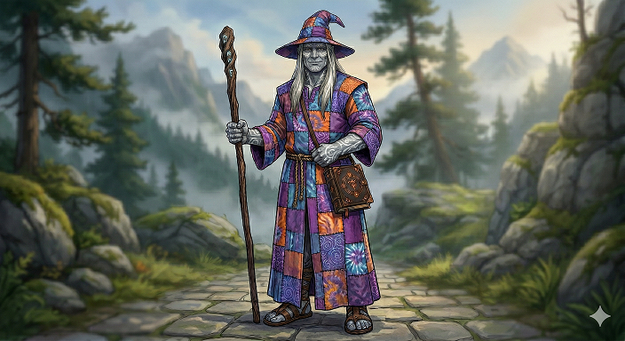

# Gaar the Great
### Wizard (School of Evocation) 10 | Curse of Strahd

> *"We could just, like... talk about this?"*

## Character Overview
Gaar the Great is a 7'8" Goliath wizard who never fit in with his strength-obsessed tribe. Where his kin valued physical competition, Gaar found an old spellbook and never looked back. He created **"Gaar the Great's Magical Spectacular"** — a one-man traveling magic show featuring prestidigitation tricks, light shows, and his signature "Roast" finale. The mists of Barovia pulled him in mid-tour, and now this tie-dye-robed, sandal-wearing hippie wizard is bringing good vibes (and fireballs) to the darkest land in the multiverse.

*   **Class:** Wizard (School of Evocation)
*   **Race:** Goliath (Cloud Giant Ancestry)
*   **Background:** Custom (Entertainer)
*   **Alignment:** Neutral Good
*   **Current HP:** ~87
*   **Spell Save DC:** 18

## The Wizard of the Roast
Gaar's playstyle revolves around three core pillars:

*   **Sculpt Spell:** Drop Fireball, Wall of Fire, and Sickening Radiance directly on top of allies — they're immune, enemies aren't.
*   **Empowered Evocation:** Add +5 INT modifier to every Magic Missile dart, every Fireball, every Dawn tick.
*   **Battlefield Control:** Lock down encounters with Hypnotic Pattern, Slow, or Wall of Force before following up with damage.

## Project Files Structure

*   **`gaar-the-great-level-10.md`** - The primary character sheet, backstory, spellbook, and tactics.
*   **`the-wizard-of-the-roast.md`** - Build summary and philosophy inspired by d4: D&D Deep Dive.

## Technical Details
*   **Ruleset:** D&D 5th Edition (2024 Revision).
*   **Key Items:** Arcane Grimoire +1 (spellcasting focus + spellbook, +1 spell save DC and attack, +1 Arcane Recovery level).
*   **Key Features:** Sculpt Spell, Empowered Evocation, War Caster, Arcane Recovery (6 levels).

---
*Created and managed with the assistance of Claude Code.*
