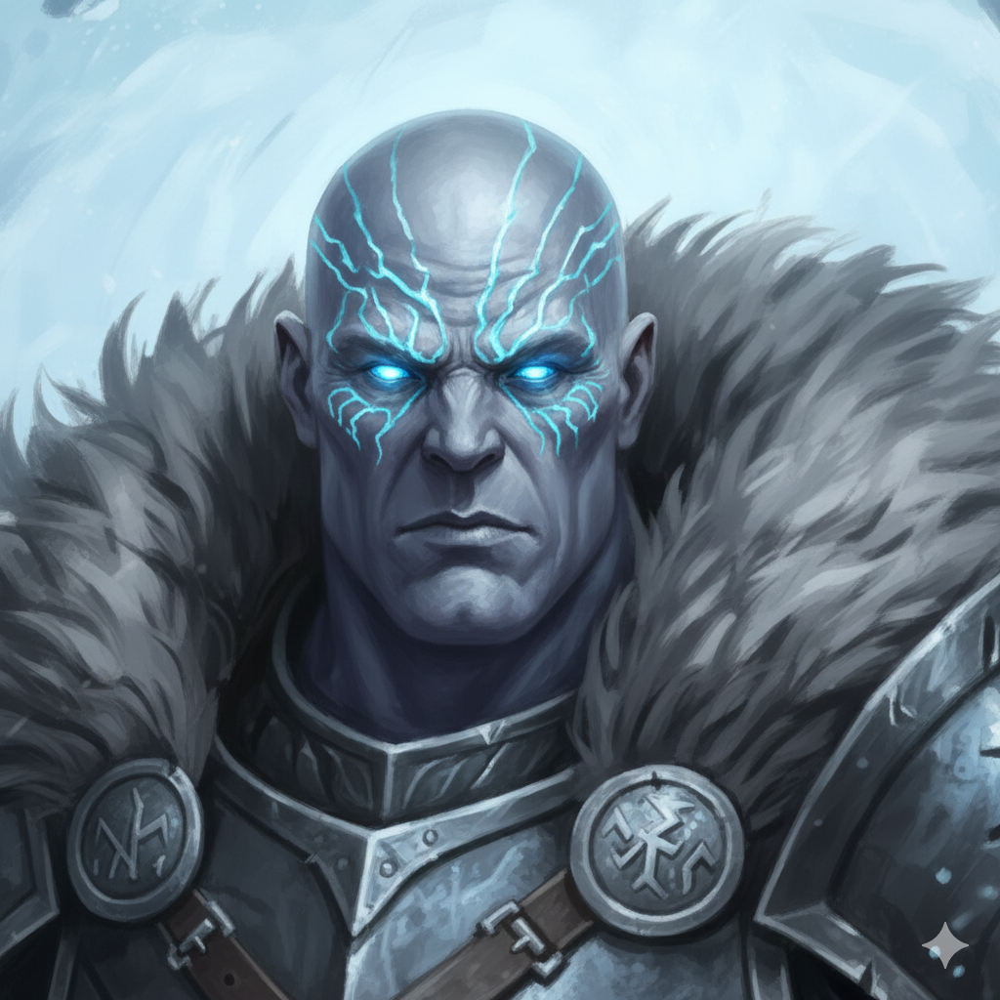

# Hrimgar Frostborn
### Ranger 2 / Druid (Circle of the Sea) 7 | The Frozen North

> *"The cold does not lie. It reveals what endures. I am the frost that lingers after the storm. I do not relent."*

## Character Overview
Hrimgar is a Goliath of Frost Giant ancestry, a stoic warrior who embodies the unyielding wrath of a winter storm. A former farmer who lost everything to a brutal winter, he has since mastered the primal forces of the ice. He does not merely survive the cold; he becomes it, transforming into a towering colossus of freezing wind and crushing ice on the battlefield.

*   **Class:** Ranger 2 / Druid (Circle of the Sea)
*   **Race:** Goliath (Frost Giant Ancestry, 2024 Rules)
*   **Background:** Farmer
*   **Alignment:** Neutral Good
*   **Current HP:** 78
*   **Strength:** 21 (Belt of Hill Giant Strength)

## The Storm Unleashed
Hrimgar's combat style is a "blizzard" of elemental power:

*   **Large Form:** Using his giant heritage to double in size and dominate the field.
*   **Wrath of the Sea:** Reflavored as a freezing aura of ice and snow that batters his foes.
*   **The Blizzard Combo:** Combining *Conjure Minor Elementals* with his giant form to become a walking environmental hazard.

## Project Files Structure

The documentation for the "Winter Storm" character project.

*   **`Hrimgar_Frostborn_CharacterSheet.md`** - The definitive record of Hrimgar's stats and abilities.
*   **`Hrimgar_Frostborn_Combat_Cheatsheet.md`** - Tactical "dashboard" for his complex transformation combos.
*   **`frostgiant_video_summary.md`** - Research notes on giant lore and mechanical inspirations.

## Technical Details
*   **Ruleset:** D&D 5th Edition (2024 Revision).
*   **Key Items:** Belt of Hill Giant Strength, +1 Hand Axe (Vex), +1 Light Hammer (Nick).
*   **Key Features:** Dual Wielder/Nick Mastery synergy, Primal Strike (Cold).

---
*Created and managed with the assistance of the Gemini CLI Agent.*
