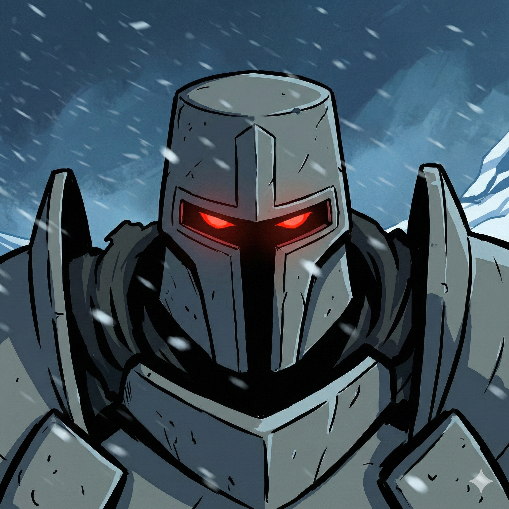

# Klaus Coldmark - Battle Master Fighter

**Level 6** | Human | Farmer Background | Lawful Neutral
**Theme:** The Iron Warlord of Ten-Towns. A silent, terrifying tactical genius who controls the battlefield with massive strikes and impenetrable defense.

---

## SECTION 1: Character Sheet
[View Level 7-12 Build Plan](build_plan.md)

### Ability Scores & Modifiers
| **STR** | **DEX** | **CON** | **INT** | **WIS** | **CHA** |
|:-------:|:-------:|:-------:|:-------:|:-------:|:-------:|
| **20 (+5)** | **16 (+3)** | **18 (+4)** | **14 (+2)** | **15 (+2)** | **5 (-3)** |

### Core Stats
- **Hit Points:** 76 (10 + 5d10 + 24 CON + 12 Tough)
- **Armor Class:** 19 (Plate 18 + Defense 1) | **Disadvantage to be hit** (Cloak of Displacement)
- **Initiative:** +6 (DEX +3, Alert +3)
- **Speed:** 30 ft.
- **Proficiency Bonus:** +3
- **Passive Perception:** 15
- **Maneuver Save DC:** 16 (8 + Prof 3 + STR 5)

### Saving Throws
| **STR** | **DEX** | **CON** | **INT** | **WIS** | **CHA** |
|:-------:|:-------:|:-------:|:-------:|:-------:|:-------:|
| **+8**  | +3      | **+7**  | +2      | +2      | -3      |
*(Proficient in Strength and Constitution)*

### Skills
| Skill | Bonus | Notes |
|:------|:-----:|:------|
| Animal Handling | +5 | Proficient (Farmer) |
| **Athletics** | **+8** | Proficient (Fighter) |
| **Insight** | **+5** | Proficient (Student of War) |
| Perception | +5 | Proficient (Fighter) |
| Survival | +5 | Proficient (Human) |

*(Tools: Carpenter's Tools, Smith's Tools)*

### Languages
- Common, Dwarvish, Orc

---

## SECTION 2: Combat & Equipment

### Weapons & Attacks
**1. +1 Maul (Magic)**
- **To Hit:** +9 (STR +5, Prof +3, Magic +1)
- **Damage:** 2d6 + 9 bludgeoning (STR +5, Magic +1, GWM +3)
- **On Hit:**
    - **Push 5ft** (Crusher Feat)
    - **Topple (Mastery):** DC 16 CON save or fall Prone.
    - **Maneuvers (Optional):** +1d8 damage + Push 15ft (Pushing Attack).

**2. Greatsword (Backup)**
- **To Hit:** +8
- **Damage:** 2d6 + 8 slashing
- **On Miss:** Deal 5 damage (Graze Mastery).

**3. Heavy Crossbow (Ranged)**
- **To Hit:** +6
- **Damage:** 1d10 + 3 piercing
- **On Hit:** Push 10ft (Push Mastery).

### Equipment
- **Plate Armor** (AC 18) - *Common Item Choice*
- **Cloak of Displacement (Rare):** Enemies have Disadvantage on attack rolls against you. (Ends until next turn if you take damage).
- **+1 Maul (Uncommon):** Magic weapon.
- **Dread Helm (Common):** This formidable iron helm makes your eyes glow red while you wear it.
- **Potions:** 3x Potion of Healing (2d4+2).
- **Gear:** Dungeoneer's Pack.

---

## SECTION 3: Class Features & Maneuvers

### Fighter Features (Level 6)
- **Second Wind (3/Long Rest):** Bonus Action to regain 1d10 + 6 HP.
- **Action Surge (1/Short Rest):** Take one additional Action on your turn.
- **Tactical Mind:** Expend a Second Wind to add 1d10 to a failed Ability Check.
- **Weapon Mastery:** Maul (Topple), Greatsword (Graze), Heavy Crossbow (Push), Battleaxe (Vex).

### Battle Master Features (Level 6)
- **Combat Superiority:** You have **4 Superiority Dice (d8)**. You regain all of them when you finish a short or long rest.
- **Student of War:** Proficiency in Insight and Smith's Tools.
- **Maneuver Save DC:** 16 (Very hard for enemies to beat).

### Active Maneuvers (3 Known)
**1. Bait and Switch**
- **Action:** None (Cost: 5ft movement).
- **Effect:** Switch places with a willing creature within 5ft. Roll 1d8 and add the number to **your AC** or **the creature's AC** until the start of your next turn.
- **Use Case:** Rescue the Wizard. Swap with them. You now have AC 19 + 1d8 + Cloak of Displacement.

**2. Riposte**
- **Trigger:** Reaction when a creature **misses** you with a melee attack.
- **Effect:** Spend 1 die. Make a melee weapon attack against the creature. If you hit, add +1d8 to the damage.
- **Synergy:** Cloak of Displacement makes them miss -> You hit them back hard.

**3. Menacing Attack**
- **Trigger:** When you hit with a weapon attack.
- **Effect:** Spend 1 die. Add +1d8 to damage. Target must make WIS Save (DC 16) or be **Frightened** of you until the end of your next turn.
- **Synergy:** A Frightened enemy has Disadvantage on attacks and **cannot move closer to you**. Combined with your Cloak, they practically cannot hit you.

### Feats
- **Tough (Origin):** +2 HP per level. (+12 HP total).
- **Alert (Origin):** +Proficiency to Initiative (+6 total). Can swap initiative.
- **Crusher (Level 4):** +1 CON. Push enemy 5ft on bludgeoning hit. Crits grant Advantage to allies.
- **Sentinel (Level 6):** +1 STR. 
    - **Speed to 0:** When you hit a creature with an Opportunity Attack, its speed becomes 0 for the rest of the turn.
    - **Disengage Ignored:** Creatures provoke Opportunity Attacks even if they take the Disengage action.
    - **Reaction Strike:** When a creature within 5ft makes an attack against a target other than you, you can use your Reaction to make a melee weapon attack against the attacking creature.

---

## SECTION 4: Combat Tactics

### The "Iron Wall" Defense
1.  **Ally in trouble?** Move adjacent to them.
2.  **Bait and Switch:** Swap places. Give yourself the AC boost (AC 20-27).
3.  **Result:** The enemy is now facing you instead of the squishy Wizard. They have Disadvantage to hit you (Cloak). If they miss, you **Riposte**.

### The "Anika's Shadow" (Sentinel + Topple + Crusher)
1.  **Trigger:** An enemy tries to move away from you to reach Anika, or attacks her while you are within 5ft.
2.  **Sentinel Strike:** Use your Reaction to attack with your Maul.
3.  **The Lockdown:** 
    - **Sentinel:** If you hit, their speed becomes 0.
    - **Topple (Mastery):** They must make a DC 16 CON save or fall **Prone**.
    - **Crusher:** Push them 5ft away from Anika.
4.  **Result:** The enemy is Prone, 5ft away from their target, and has **0 Speed**. Since standing up costs half your movement, and they have 0 movement, they are stuck on the ground, granting Advantage to all your melee attacks on your next turn.

### The "Dread" Factor
Even without Charisma, your presence is terrifying. The **Dread Helm** glowing red, the massive armor, and the fact that you move faster than a man your size should (Alert feat) makes you a force of nature.

---

## Character Description

**Appearance:** Klaus is a void in the blinding white of the Dale. He is clad in featureless, matte-gray Plate Armor that seems to absorb light rather than reflect it. He wears a heavy "Great Helm" with a narrow T-visor; within the dark slit of the visor, two intense red points of light glow ominously (Dread Helm). His massive maul is a block of dark iron on a steel haft. His Cloak of Displacement hangs like a shifting shadow, making his exact position difficult to pin down. 
**Personality:** Socially inept (-3 CHA) and utterly pragmatic. He does not boast or threaten. He simply occupies space that enemies want, and refuses to move. He is the wall that breaks the wind.
**Background:** A survivor who realized that in the Everlasting Rime, hope is heavy, but steel is reliable. He forged himself into a weapon to protect what little remains of Ten-Towns.

*"..." (Klaus simply points his maul at the enemy, then at the ground.)*

---

## SECTION 5: Backstory & Relationships

### The Tribe of the Elk

Klaus was raised within the Tribe of the Elk, one of the nomadic Reghed tribes of Icewind Dale. While his kin were known for their hardiness and vocal traditions, Klaus was the shadow in the corner. In his younger years, he was the quiet kid most people forgot was in the room. This isolation didn't breed resentment, but focus. He spent his solitude studying the mechanics of motion and the lethality of steel, developing a proficiency for martial combat that far outstripped his peers.

### The Bond of Iron: Anika

Klaus’s world revolved around his older sister, **Anika**. To Klaus, Anika was—and is—perfect. She possessed the grace, social ease, and leadership he lacked. Whenever members of the tribe mistreated or mocked Klaus for his silence or social awkwardness, Anika was his fierce protector. He idolized her, seeing her as someone who could do no wrong.

### The Vow of Protection

When Anika decided to leave the Tribe of the Elk to make a difference in the wider world, Klaus felt he had no choice. He didn't leave for adventure or altruism; he left because he believes Anika is the most important person in the world, and he is the only one capable of ensuring she survives it. He is her silent sentinel, the iron wall that stands between her and anything that would do her harm.
