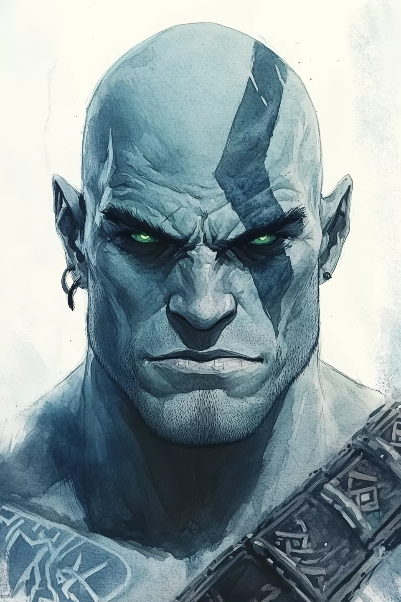

# Kram Gor (DECEASED)
### Paladin (Oath of Conquest) 6 | Icewind Dale

> *"The stillness has come. The winter is complete."*

## Status: DECEASED
Kram Gor fell in battle against a Lich on February 1, 2026. After a final stand to protect his party, he failed his death saves. His silence, once a chosen discipline, is now absolute.

## Character Overview
Kram was a Goliath former barbarian who was resurrected by Auril, the Frostmaiden, as an Oath of Conquest Paladin. Trading the warm voice of the World Tree for the cold silence of the Frostmaiden, he served as a "sharpened restraint" for his goddess. He was the "Silent Winter"—unyielding, unmoving, and ultimately, at rest.

*   **Class:** Paladin (Oath of Conquest)
*   **Race:** Goliath (Frost Giant Ancestry, 2024 Rules)
*   **Background:** Farmer (Keledek-Katho Tribe)
*   **Alignment:** Lawful Neutral
*   **Final Level:** 6
*   **Deity:** Auril, the Frostmaiden

## Legacy of the Frostbound
Kram's service was marked by a terrifying, cold presence:

*   **Conquering Presence:** A Channel Divinity that spread unnatural silence and fear.
*   **Frostmaiden's Brand:** A glowing six-pointed snowflake on his forearm that channeled his power.
*   **The Ironspine Guard:** He was the primary protector for the warlock Inara, his anchor to his former life.

## Project Files Structure

The permanent archive of Kram Gor's journey.

*   **`Kram_Gor_Conquest_Paladin.md`** - The final, definitive character sheet and backstory.
*   **`Kram_Gor_Combat_Cheatsheet.md`** - Tactical reference used during his final campaign.
*   **`Kram_Gor_Level_5-10_Progression_Guide.md`** - The unrealized roadmap for his growth in power.

## Technical Details
*   **Ruleset:** D&D 5th Edition (2024 Revision).
*   **Key Items:** Armor of Cold Resistance, Berserker Greataxe +1, Winged Boots.
*   **Key Features:** Aura of Protection, Cleave Mastery, Large Form.

---
*Created and managed with the assistance of the Gemini CLI Agent.*
